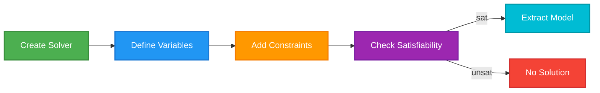

# Solving the Impossible
An Introduction to the Z3 SMT Solver

Press Space to start the magic

---
layout: default
---

# What is Z3?

Z3 is a state-of-the-art **Satisfiability Modulo Theories (SMT) solver** developed by Microsoft Research.

<v-click>

### But what does that actually mean?
* **SAT (Boolean Satisfiability):** Can I make this complex boolean formula `True`?

* **Modulo Theories:** Let's add real math to it! (Integers, Reals, Bitvectors, Arrays, Strings).
* **Solver:** It uses highly optimized heuristics to search massive solution spaces instantly.

</v-click>

<v-click>

<br>

### The Paradigm Shift
* **Imperative (Normal CS):** Step 1, Step 2, loop, branch... *how* to find the answer.

* **Declarative (Z3):** Here are the rules. *You* figure out the answer.


</v-click>

---
layout: center
---

# Getting Started with Z3 in Python

Z3 has bindings for many languages, but Python is the most accessible for prototyping.

```bash
pip install z3-solver
```
Let's look at a basic workflow:

1. Create a `Solver()` instance.
2. Define your Variables.
3. Add Constraints (`solver.add(...)`).
4. Check for Satisfiability (`solver.check()`).
5. Extract the Model (the solution).

<br>



---
layout: default
---

### Puzzle 1: Cryptarithmetic
Let's solve a classic constraint satisfaction problem. Assign a unique digit (0-9) to each letter so the equation holds true. S and M cannot be zero.

<div class="flex justify-center text-4xl font-mono mt-4 mb-4">
<div>
<div>&nbsp;S E N D</div>
<div>+M O R E</div>
<hr>
<div>M O N E Y</div>
</div>
</div>

<v-click>

How would we solve this normally? 8 nested for loops? Backtracking algorithm?

Let's see how Z3 does it.

</v-click>

---
layout: default
---

### Puzzle 1: Modeling with Z3
First, we define our variables and the basic rules of the puzzle.

```python {monaco-run}
from z3 import *

solver = Solver()

# 1. Define Variables (Integers)
letters = [S, E, N, D, M, O, R, Y] = Ints('S E N D M O R Y')

# 2. Basic Constraints
# Every letter is between 0 and 9
solver.add([And(letter >= 0, letter <= 9) for letter in letters])

# All letters represent distinct digits
solver.add(Distinct(letters))

# Leading digits cannot be zero
solver.add(S != 0, M != 0)

print(solver)
```

---
layout: default
---

### Puzzle 1: The Core Logic
Now, we translate the arithmetic into a single Z3 constraint. You can run this directly!

```python {monaco-run}
from z3 import *

solver = Solver()
S, E, N, D, M, O, R, Y = Ints('S E N D M O R Y')
solver.add([And(L >= 0, L <= 9) for L in [S, E, N, D, M, O, R, Y]])
solver.add(Distinct(S, E, N, D, M, O, R, Y))
solver.add(S != 0, M != 0)

# 3. The Math Constraint
send  =             S * 1000 + E * 100 + N * 10 + D
more  =             M * 1000 + O * 100 + R * 10 + E
money = M * 10000 + O * 1000 + N * 100 + E * 10 + Y

solver.add(send + more == money)

# 4. Solve and Extract!
if solver.check() == sat:
    print(solver.model())
else:
    print("No solution exists")
```

---
layout: default
---

### Puzzle 1: Is the Solution Unique?
How do we know if we found the *only* answer? In Z3, we can just add a new constraint that outlaws the current solution and check if another one exists!

<div class="h-80 overflow-y-auto w-full">

```python {monaco-run}
from z3 import *

solver = Solver()
S, E, N, D, M, O, R, Y = Ints('S E N D M O R Y')
solver.add([And(L >= 0, L <= 9) for L in [S, E, N, D, M, O, R, Y]])
solver.add(Distinct(S, E, N, D, M, O, R, Y))
solver.add(S != 0, M != 0)

send  =             S * 1000 + E * 100 + N * 10 + D
more  =             M * 1000 + O * 100 + R * 10 + E
money = M * 10000 + O * 1000 + N * 100 + E * 10 + Y
solver.add(send + more == money)

# Get the first solution
assert solver.check() == sat
m1 = solver.model()
print("Solution 1:", m1)

# Block the first solution 
# "At least one variable must be different"
block = Or([L != m1[L] for L in [S, E, N, D, M, O, R, Y]])
solver.add(block)

if solver.check() == sat:
    print("Found another! Solution 2:", solver.model())
else:
    print("Solution is unique!")
```

</div>

---
layout: default
---

### Puzzle 2: The N-Queens Problem
**The Problem:** Place N chess queens on an N×N chessboard so that no two queens threaten each other.

* No two queens can share the same row.
* No two queens can share the same column.
* No two queens can share the same diagonal.

This is a classic backtracking assignment in CS. 

Let's see how Z3 destroys it.


---
layout: default
---

### Puzzle 2: Modeling the Board
Instead of a 2D grid, let's represent the board using an array of integers.
`Q[i]` will store the row index of the queen placed in the i-th column.

```python {monaco-run}
from z3 import *

N = 8
# Q[i] represents the row position of the queen in column i
Q = [Int(f'Q_{i}') for i in range(N)]

solver = Solver()

# Constraint 1: Every queen must be on a valid row (0 to N-1)
solver.add([And(Q[i] >= 0, Q[i] < N) for i in range(N)])

print(solver)
```

---
layout: default
---

### Puzzle 2: The Rules of Chess
Now we encode the "threatening" rules. Because of our array structure, we already know no two queens share a column! We just need to check rows and diagonals.

```python {monaco-run}
from z3 import *

N = 8
Q = [Int(f'Q_{i}') for i in range(N)]
solver = Solver()
solver.add([And(Q[i] >= 0, Q[i] < N) for i in range(N)])

# Constraint 2: No two queens share the same row
solver.add(Distinct(Q))

# Constraint 3: No two queens share the same diagonal
for i in range(N):
    for j in range(i + 1, N):
        solver.add(Q[i] - Q[j] != i - j) # Main diagonal
        solver.add(Q[i] - Q[j] != j - i) # Anti-diagonal

print("Constraints added:", len(solver.assertions()))
```

<v-click>

**Why the diagonal math?**
If two pieces are on the same diagonal, the absolute difference of their columns equals the absolute difference of their rows: `abs(Q[i] - Q[j]) == abs(i - j)`.

</v-click>

---
layout: default
---

### Puzzle 2: Print the Solution
Run the code below to see the 8-Queens solution!

```python {monaco-run}
from z3 import *

N = 8
Q = [Int(f'Q_{i}') for i in range(N)]
solver = Solver()
solver.add([And(Q[i] >= 0, Q[i] < N) for i in range(N)])
solver.add(Distinct(Q))
for i in range(N):
    for j in range(i + 1, N):
        solver.add(Q[i] - Q[j] != i - j)
        solver.add(Q[i] - Q[j] != j - i)

if solver.check() == sat:
    model = solver.model()
    # Extract the values and print the board
    solution = [model.evaluate(Q[i]).as_long() for i in range(N)]
    for row in range(N):
        # Print a 'Q' if the solution's row matches the current row, else '.'
        line = ['Q' if solution[col] == row else '.' for col in range(N)]
        print(" ".join(line))
else:
    print("No solution")
```

---
layout: center
---

# Summary
Z3 allows us to state the "what" instead of the "how".

* We modeled **Cryptarithmetic** using basic algebra and `Distinct`.
* We modeled **N-Queens** using clever array representation and absolute differences.

Next Steps: Try modeling Sudoku, graph coloring, or even a basic scheduling system using Z3!

### Questions?
