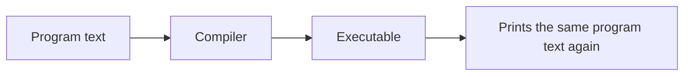
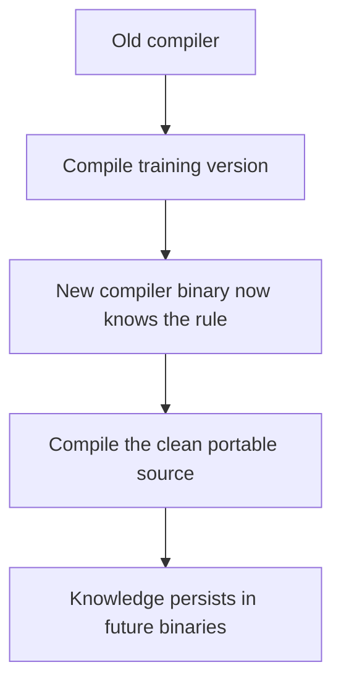

# On Trusting Trust

## Ken Thompson, Communications of the ACM, August 1984

How a compiler can hide a backdoor
that survives clean source code

---
layout: two-cols
---

# Ken Thompson
## The Unix Pioneer

- **Co-creator of Unix** (at Bell Labs with Dennis Ritchie)

- **Co-creator of the C programming language** <br/>(with Dennis Ritchie)
- Created the **B programming language** <br/>(precursor to C)
- Developed the **UTF-8** encoding
- Key designer of the **Go** programming language
- Winner of the **1983 Turing Award**

::right::

<div class="flex items-center justify-center mt-10">
  
</div>

<div class="flex items-center justify-center mt-10">
  
</div>

---
layout: two-cols
---

# 1983 Turing Award
## "Reflections on Trusting Trust"

- **Occasion**: ACM Turing Award Lecture

- **Date**: Delivered 1983, Published August 1984
- **Core Message**: "You can't trust code that you did not totally create yourself."
- Introduced the concept of **compiler Trojans** which are invisible in source code.

::right::

<div class="flex items-center justify-center">
  
</div>

---
layout: center
---

# The Paper's Flow


1. `Stage I`: self-reproducing programs
2. `Stage II`: how a compiler learns escape sequences like `\n`
3. `Stage III`: how a Trojan can survive source review
4. `Moral`: source code is not the whole trust boundary

---
layout: two-cols
---

# Stage I
## Quines

A **quine** is a program that prints its own source code.

Why Thompson starts here:

- a program can generate another copy of itself
- the copied program can carry arbitrary extra payload
- self-reproduction is the key ingredient for persistence

::right::

```python
s = 's = %r\nprint(s %% s)'
print(s % s)
```

The trick is simple:

- store a description of the program as data
- print that data in a form that recreates the whole program

---
layout: center
---

# Why Quines Matter Here



Thompson's two key observations:

- the self-reproducing part can be generated automatically
- the reproduced text can include hidden "excess baggage"

That excess baggage becomes the future Trojan.

---
layout: center
---

# Quine Gallery

## Examples from the assignment submissions

One slide per distinct quine idea:

- classic template quines
- polyglot quines
- stateful and self-modifying quines
- language-themed quines in Bash, Hebrew JS, Brainfuck, C++, and more

The partner submission by Ron Ben Israel and Ron Eliaz is shown once.

---
layout: two-cols
class: text-sm
---

# אור בורנשטיין
## Compile-Time C++ Quine

```cpp
constexpr auto data = std::array{
    /* the whole source as chars */
    static_cast<char>(0xFF),
};

static constexpr std::string do_magic() {
    auto sep = std::ranges::find(data, static_cast<char>(0xFF));
    ...
}
```

::right::

- the source is stored as a `constexpr` array of characters
- `0xFF` acts as a sentinel between the prefix and suffix
- helper logic escapes newlines, quotes, and backslashes, then reassembles the full file
- the fun twist is that the quine is built with modern C++ compile-time machinery

---
layout: two-cols
class: text-sm
---

# אריאל ביתן
## `BOMB.py`

```python
import sys, os; s='import sys, os; s=%r; print(s%%s); os.remove(sys.argv[0])'; print(s%s); os.remove(sys.argv[0])
```

::right::

- this is a compact `%r`-style Python quine
- after printing itself, it deletes its own source file
- the joke is that the code survives only in the emitted copy
- it turns self-reproduction into a one-shot "print me before I disappear" trick

---
layout: two-cols
class: text-sm
---

# אריאל ביתן
## `EXP.py`

```python
import sympy as sp
x = sp.Symbol("x")
f = sp.exp(x)
df = sp.diff(f, x)
s = '... sp.{0}; df = sp.diff(f, x); ...'
print(s.format(df, s))
```

::right::

- this quine mixes symbolic algebra with self-reference
- it computes the derivative of the expression embedded in the source
- choosing `exp(x)` is the clever part, because `d/dx exp(x) = exp(x)`
- the program stays unchanged because it picked a mathematical fixed point

---
layout: two-cols
class: text-sm
---

# אריאל ביתן
## `INC_COLOR.py`

```python
import sys; n=1; c=[31, 32, 33, 34, 35, 36]
s='... print(f"\\033[{color}m{s.format(n, c, s)}\\033[0m"); open(sys.argv[0], "w").write(s.format(n+1, c, s))'
color=c[n%len(c)]
print(f"\033[{color}m{s.format(n, c, s)}\033[0m")
open(sys.argv[0], "w").write(s.format(n+1, c, s))
```

::right::

- this is a stateful quine family rather than a frozen single instance
- it prints the current source in a rotating ANSI color
- then it rewrites its own file with `n + 1`, so the next generation changes color
- the source reproduces itself while also carrying state forward

---
layout: two-cols
class: text-sm
---

# בן חיים קריף
## C / Python Polyglot

```c
#include <stdio.h> /*
'''
*/
char *s = "...";
int main(){ printf(s, ...); }
/*
'''
s = "..."
print(s % (...), end='')
# */
```

::right::

- one file is valid in both C and Python
- C sees Python pieces inside comments; Python sees C pieces inside a triple-quoted string
- both languages share the same `%c` / `%s` format-string trick
- it is a true polyglot quine: two runtimes, one source, same reproduced bytes

---
layout: two-cols
class: text-sm
---

# גיא יהושע
## Omega Quine

```python
(lambda x: print(x % x))('(lambda x: print(x %% x))(%r)')
```

::right::

- this quine has no named storage outside the lambda argument itself
- the program feeds a description of itself back into itself
- the idea echoes the lambda-calculus "omega" style of self-application
- it is beautiful because the whole quine collapses into one compact expression

---
layout: two-cols
class: text-sm
---

# גל שחם
## JavaScript Array Quine

```js
arr = [
  'arr = ',
  'log',
  'arr.forEach((v, i) => console[v] ? console[v](arr) : process.stdout.write(v));'
]
arr.forEach((v, i) => console[v] ? console[v](arr) : process.stdout.write(v));
```

::right::

- the array stores the three building blocks of the whole program
- raw strings print the assignment prefix and the loop itself
- `console.log(arr)` prints the array literal in the middle
- the trick is to let JavaScript's own array pretty-printer serialize the data section

---
layout: two-cols
class: text-sm
---

# דניאל שמיר
## Bash Banner Quine

```bash
f () {
    toilet -t -f pagga -F border \
      "$(printf '%s\n' '#!/bin/bash --' "$(declare -f f)" 'f')"
}
f
```

::right::

- `declare -f f` asks Bash for the source of the function `f`
- `printf` then rebuilds the whole script from the shebang, the function body, and the final call
- `toilet` turns the output into styled ASCII art with a border
- the self-copy is still exact in content, but displayed in a playful way

---
layout: two-cols
class: text-sm
---

# טל משה מלמה
## Exception-Trace Quine

```python
sys.excepthook = hook
print(s%s)
(lambda f: f(f))(lambda f: f(f))

# Traceback ...
# RecursionError: maximum recursion depth exceeded
```

::right::

- first it prints its own stored source in the normal quine way
- then it deliberately triggers infinite self-application
- a custom `sys.excepthook` rewrites the traceback as commented lines
- those commented traceback lines are already embedded in the file, so the crash becomes part of the quine

---
layout: two-cols
class: text-sm
---

# יואב ביידר
## Hebrew Haiku Quine

<pre dir="rtl" class="text-sm leading-tight font-sans bg-gray-100 p-3 rounded">
יהי קוד = "יהי קוד = ...";
בקרה.תעד(קוד.פרוס(0,10) + פנחס.מחרז(קוד) + ';');
בקרה.תעד(קוד.פרוס(11,199));
...
// זהו קוד אשר
// מדפיס את כל התוכן
// שלו בעברית
</pre>

::right::

- this one is written in a Hebrew-flavored JavaScript dialect
- it prints slices of its own source string and uses a stringify helper to reinsert the quoted body
- the comments frame the quine as a small Hebrew haiku
- the main novelty is not just self-reference, but self-reference in a playful linguistic setting

---
layout: two-cols
class: text-sm
---

# יובל בכר
## Java -> Python Relay

```java
String p = "p = %c%s%c ... print(j %% (...))";
String j = "public class Quine{ ... }";
System.out.printf(p, 34, p, 34, 10, 34, j, 34, 10);
```

::right::

- this one is best understood as a two-step quine cycle
- the Java program prints a Python program
- that Python program, in turn, contains the template needed to reconstruct the Java source
- so it is a cross-language relay: Java -> Python -> Java

---
layout: two-cols
class: text-sm
---

# עומר אבירם
## Evolutionary Chess Quine

```python
m = 0
s = '... m = %d ... print(s %% (m + 1, s))'
moves = [(52, 36), (12, 28), (61, 25), (3, 39)]
...
print("\n[ Board State - Move %d ]" % m)
print(s % (m + 1, s))
```

::right::

- this is a quine as a state machine, not just a mirror
- `m` is the generation counter, and each run applies one more chess move
- the program prints the current board state and then emits the next generation of its own source
- it turns a quine into a tiny evolving narrative

---
layout: two-cols
class: text-sm
---

# עמית אושרי פוירשטיין
## Brainfuck Tape Quine

```python
bigline = ''.join("+" * ord(c) + ">>>" for c in code)

with open("quine.bf", "w") as f:
    f.write(">>>" + bigline + code + '\n')
```

::right::

- the submission links to a repo with an annotated Brainfuck quine and a small generator script
- the generator encodes every source character as repeated `+` operations on the tape
- the resulting Brainfuck program reconstructs its bootstrap, then walks the tape and prints its own code
- the clever part is translating "data about the program" into raw tape state

---
layout: two-cols
class: text-sm
---

# רון בן ישראל + רון אליעז
## Shared C / Python Polyglot

```c
#define useless /*
unused="""
#*/
int main() { ... printf(s, ...); }
/*
"""
...
print(s % (...), end="")
#*/
```

::right::

- both `main.c` and `main.py` are exactly the same bytes
- the trick is overlapping comment syntax: C ignores the Python part and Python ignores the C part
- both ends use the same master format string `s`
- compared with the earlier polyglot, this version leans harder on comment choreography

---
layout: two-cols
class: text-sm
---

# שחף כהן
## DNA Quine

```python
DNA = 'DNA = %r\ndef replicate(DNA): print(DNA %% DNA)\nreplicate(DNA)'
def replicate(DNA): print(DNA % DNA)
replicate(DNA)
```

::right::

- this is a clean Python `%r` quine with a biological metaphor
- the variable `DNA` is both blueprint and payload
- `replicate()` plays the role of the cellular machinery that reads the blueprint and builds the copy
- it is a simple quine, but the metaphor makes the self-reference immediately intuitive

---
layout: default
---

# Stage II
## How the C compiler understands `\n`

When the compiler reads a string literal like `"Hello\n"`, it must turn the
two source characters `\` and `n` into the internal newline character.

```c
int escape(int c) {
    if (c == 'n')
        return '\n';
    return c;
}
```

Why this is subtle:

- the compiler source is written in C
- the compiler is compiled by an older compiler
- the old compiler already knows what `'\n'` means

So the new compiler binary preserves that knowledge when it compiles itself.

---
layout: default
---

# Training The Compiler

Thompson's example is adding support for `\v` (vertical tab).

The desired portable source is easy to write:

```c
if (c == 'v')
    return '\v';
```

But the **old** compiler rejects it, because it does not know `\v` yet.

So we train it once:

```c
if (c == 'v')
    return 11;
```

Then the process is:

1. compile once with the old compiler
2. install the new binary compiler
3. restore the portable `'\v'` version in the source
4. recompile and keep the learned behavior forever

---
layout: center
---

# The Stage II Insight



The compiler can learn a behavior once and then reproduce it later,
even when the training source is gone.

---
layout: default
---

# Stage III
## First Trojan: attack `login`

Imagine modifying the compiler so that when it compiles the UNIX `login`
program, it silently inserts a backdoor.

```c
void compile(char *src) {
    if (matches_login_source(src))
        emit_login_binary_with_secret_password();
    else
        normal_compile(src);
}
```

Result:

- `login.c` looks innocent
- the compiled `login` binary accepts a hidden password
- but the compiler source is now suspicious and easy to catch

By itself, this Trojan does not stay hidden for long.

---
layout: default
---

# Second Trojan: attack the compiler itself

Now add another trigger:

```c
void compile(char *src) {
    if (matches_login_source(src))
        inject_login_backdoor();

    if (matches_compiler_source(src))
        inject_login_backdoor_and_this_same_compiler_trojan();

    normal_compile(src);
}
```

This second payload is the crucial step:

- when compiling `login`, inject the login backdoor
- when compiling the C compiler, inject both Trojans again
- after that, the source of the compiler can be cleaned up

The malicious behavior now lives in the compiler **binary**, not in the
current compiler source code.

---
layout: center
---

# Why Code Review Fails

| What you inspect | What you see | What the infected compiler does |
| --- | --- | --- |
| current `login.c` | clean source | inserts the backdoor into the binary |
| current `cc.c` | clean source | reinserts both Trojans into the new compiler binary |
| rebuilt system | "compiled from source" | still contains the hidden attack |

This is exactly Thompson's point:

- reviewing the current system source is not enough
- reviewing the current compiler source is not enough
- the attack survives because the binary compiler is already poisoned

---
layout: center
---

# Moral

> "You can't trust code that you did not totally create yourself."

High-level takeaway:

- source review tells us what the source says
- it does **not** prove what binary is actually running
- trust in a toolchain must include the compiler, assembler, linker, and below

Modern responses were developed later, such as trusted bootstrap chains,
diverse double-compiling, and reproducible builds, but Thompson's paper is the
classic warning that the trust problem starts below the source code.

---
layout: center
---

# One-Slide Summary

`Quine` -> `compiler learning` -> `self-reproducing Trojan`

The paper's core idea is that a compiler can be taught to insert a backdoor
into other programs, and then to insert the same hidden behavior into future
versions of itself, leaving both the application source and the compiler source
apparently clean.
