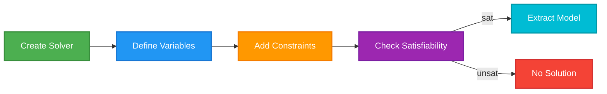
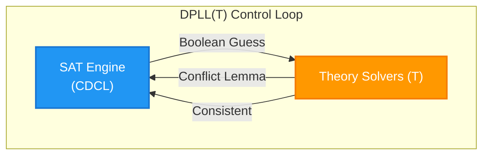
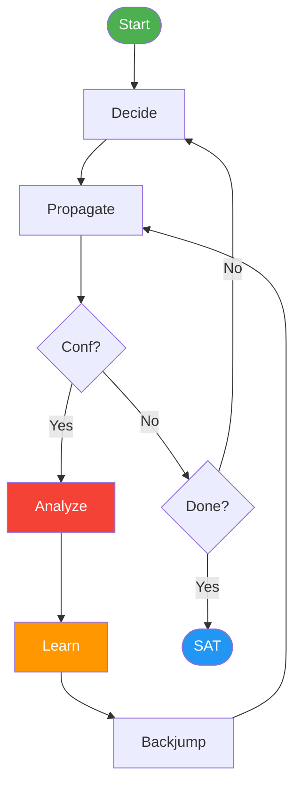

# Solving the Impossible
An Introduction to the Z3 SMT Solver

Press Space to start the magic

---
layout: default
---

# What is Z3?

Z3 is a state-of-the-art **Satisfiability Modulo Theories (SMT) solver** developed by Microsoft Research.

<v-click>

### But what does that actually mean?
* **SAT (Boolean Satisfiability):** Can I make this complex boolean formula `True`?

* **Modulo Theories:** Let's add real math to it! (Integers, Reals, Bitvectors, Arrays, Strings).
* **Solver:** It uses highly optimized heuristics to search massive solution spaces instantly.

</v-click>

<v-click>

<br>

### The Paradigm Shift
* **Imperative (Normal CS):** Step 1, Step 2, loop, branch... *how* to find the answer.

* **Declarative (Z3):** Here are the rules. *You* figure out the answer.


</v-click>

---
layout: center
---

# Getting Started with Z3 in Python

Z3 has bindings for many languages, but Python is the most accessible for prototyping.

```bash
pip install z3-solver
```
Let's look at a basic workflow:

1. Create a `Solver()` instance.
2. Define your Variables.
3. Add Constraints (`solver.add(...)`).
4. Check for Satisfiability (`solver.check()`).
5. Extract the Model (the solution).

<br>



---
layout: default
---

### Puzzle 1: Cryptarithmetic
Let's solve a classic constraint satisfaction problem. Assign a unique digit (0-9) to each letter so the equation holds true. S and M cannot be zero.

<div class="flex justify-center text-4xl font-mono mt-4 mb-4">
<div>
<div>&nbsp;S E N D</div>
<div>+M O R E</div>
<hr>
<div>M O N E Y</div>
</div>
</div>

<v-click>

How would we solve this normally? 8 nested for loops? Backtracking algorithm?

<div class="absolute bottom-4 right-10 w-100 shadow-2xl rounded-xl bg-white/10 backdrop-blur-md p-2 border border-white/20 scale-100 transform rotate-1">

```python {monaco} {editorOptions: { fontSize: 8 }}
# The "Brute Force" Approach
for S in range(1, 10):
 for E in range(10):
  for N in range(10):
   for D in range(10):
    for M in range(1, 10):
     for O in range(10):
      for R in range(10):
       for Y in range(10):
        if len({S,E,N,D,M,O,R,Y}) == 8:
         send = S*1000 + E*100 + N*10 + D
         more = M*1000 + O*100 + R*10 + E
         money = M*10000 + O*1000 + N*100 + E*10 + Y
         if send + more == money:
          print("Found it!")
```
</div>
</v-click>

<v-click>

Let's see how Z3 does it.

</v-click>


---
layout: default
class: puzzle1-modeling-code
---

### Puzzle 1: Modeling with Z3
First, we define our variables and the basic rules of the puzzle.


```python {monaco-run} {editorOptions: { fontSize: 10 }}
from z3 import *

# 1. Create a Solver instance
solver = Solver()

# 2. Define Variables
letters = [S, E, N, D, M, O, R, Y] = Ints('S E N D M O R Y')

# 3. Add Constraints
# Every letter is between 0 and 9
solver.add([And(letter >= 0, letter <= 9) for letter in letters])

# All letters represent distinct digits
solver.add(Distinct(letters))

# Leading digits cannot be zero
solver.add(S != 0, M != 0)

print(solver)
```


---
layout: default
---

### Puzzle 1: The Core Logic
Now, we translate the arithmetic into a single Z3 constraint. You can run this directly!

```python {monaco-run}
from z3 import *

solver = Solver()
S, E, N, D, M, O, R, Y = Ints('S E N D M O R Y')
solver.add([And(L >= 0, L <= 9) for L in [S, E, N, D, M, O, R, Y]])
solver.add(Distinct(S, E, N, D, M, O, R, Y))
solver.add(S != 0, M != 0)

# 3. The Math Constraint
send  =             S * 1000 + E * 100 + N * 10 + D
more  =             M * 1000 + O * 100 + R * 10 + E
money = M * 10000 + O * 1000 + N * 100 + E * 10 + Y

solver.add(send + more == money)

# 4. Solve and Extract!
if solver.check() == sat:
    print(solver.model())
else:
    print("No solution exists")
```


---
layout: default
---

### Puzzle 1: Is the Solution Unique?
How do we know if we found the *only* answer? In Z3, we can just add a new constraint that outlaws the current solution and check if another one exists!


<div id="puzzle1-code22" class="h-80 overflow-y-auto w-full">

```python {monaco-run}
from z3 import *

solver = Solver()
S, E, N, D, M, O, R, Y = Ints('S E N D M O R Y')
solver.add([And(L >= 0, L <= 9) for L in [S, E, N, D, M, O, R, Y]])
solver.add(Distinct(S, E, N, D, M, O, R, Y))
solver.add(S != 0, M != 0)

send  =             S * 1000 + E * 100 + N * 10 + D
more  =             M * 1000 + O * 100 + R * 10 + E
money = M * 10000 + O * 1000 + N * 100 + E * 10 + Y
solver.add(send + more == money)

# Get the first solution
assert solver.check() == sat
m1 = solver.model()
print("Solution 1:", m1)

# Block the first solution 
# "At least one variable must be different"
diff = Or([L != m1[L] for L in [S, E, N, D, M, O, R, Y]])
solver.add(diff)

if solver.check() == sat:
    print("Found another! Solution 2:", solver.model())
else:
    print("Solution is unique!")
```

</div>

<div class="absolute bottom-52 right-30 w-max drop-shadow-xl z-50">
  
$$ \text{diff} \equiv \bigvee_{L \in \text{Letters}} (L \neq m_1[L]) $$
</div>


<AutoScrollBottom target="puzzle1-code22" />

---
layout: default
---

### Puzzle 2: The N-Queens Problem
**The Problem:** Place N chess queens on an N×N chessboard so that no two queens threaten each other.

* No two queens can share the same row.
* No two queens can share the same column.
* No two queens can share the same diagonal.

This is a classic backtracking assignment in CS. 

Let's see how Z3 destroys it.


---
layout: default
---

### Puzzle 2: Modeling the Board
Instead of a 2D grid, let's represent the board using an array of integers.
`Q[i]` will store the row index of the queen placed in the i-th column.

```python {monaco-run}
from z3 import *

N = 8

# Q[i] represents the row position of the queen in column i
Q = [Int(f'Q_{i}') for i in range(N)]

solver = Solver()

# Constraint 1: Every queen must be on a valid row (0 to N-1)
solver.add([And(Q[i] >= 0, Q[i] < N) for i in range(N)])

print(solver)
```

---
layout: default
---

### Puzzle 2: The Rules of Chess
Now we encode the "threatening" rules. Because of our array structure, we already know no two queens share a column! We just need to check rows and diagonals.

<div id="queens-code" class="h-56 overflow-y-auto w-full">

```python {monaco-run}
from z3 import *

N = 8

Q = [Int(f'Q_{i}') for i in range(N)]
solver = Solver()
solver.add([And(Q[i] >= 0, Q[i] < N) for i in range(N)])

# Constraint 2: No two queens share the same row
solver.add(Distinct(Q))

# Constraint 3: No two queens share the same diagonal
for i in range(N):
    for j in range(i + 1, N):
        solver.add(Q[i] - Q[j] != i - j) # Main diagonal
        solver.add(Q[i] - Q[j] != j - i) # Anti-diagonal

print("Constraints added:", len(solver.assertions()))
```

</div>

<AutoScrollBottom target="queens-code" />

<v-click>

<br>
<br>

**Why the diagonal math?**
If two pieces are on the same diagonal, the absolute difference of their columns equals the absolute difference of their rows. 


<div class="absolute top-50 right-25 flex justify-center gap-12 mt-4 text-sm">
  <div class="text-center">
    <div class="font-bold text-blue-500 mb-2">Main Diagonal (\)</div>
    <table class="border-collapse border border-gray-500 mx-auto">
      <tbody>
        <tr><td class="w-8 h-8 border border-gray-500 bg-blue-200"></td><td class="w-8 h-8 border border-gray-500"></td><td class="w-8 h-8 border border-gray-500"></td></tr>
        <tr><td class="w-8 h-8 border border-gray-500"></td><td class="w-8 h-8 border border-gray-500 bg-blue-200"></td><td class="w-8 h-8 border border-gray-500"></td></tr>
        <tr><td class="w-8 h-8 border border-gray-500"></td><td class="w-8 h-8 border border-gray-500"></td><td class="w-8 h-8 border border-gray-500 bg-blue-200"></td></tr>
      </tbody>
    </table>
    <div class="mt-3">
      <code>row - col = constant</code><br>
      <code>Q[i] - i == Q[j] - j</code><br>
      <div class="text-blue-500 font-bold mt-1 text-base">Q[i] - Q[j] == i - j</div>
    </div>
  </div>
  <div class="text-center">
    <div class="font-bold text-red-500 mb-2">Anti-Diagonal (/)</div>
    <table class="border-collapse border border-gray-500 mx-auto">
      <tbody>
        <tr><td class="w-8 h-8 border border-gray-500"></td><td class="w-8 h-8 border border-gray-500"></td><td class="w-8 h-8 border border-gray-500 bg-red-200"></td></tr>
        <tr><td class="w-8 h-8 border border-gray-500"></td><td class="w-8 h-8 border border-gray-500 bg-red-200"></td><td class="w-8 h-8 border border-gray-500"></td></tr>
        <tr><td class="w-8 h-8 border border-gray-500 bg-red-200"></td><td class="w-8 h-8 border border-gray-500"></td><td class="w-8 h-8 border border-gray-500"></td></tr>
      </tbody>
    </table>
    <div class="mt-3">
      <code>row + col = constant</code><br>
      <code>Q[i] + i == Q[j] + j</code><br>
      <div class="text-red-500 font-bold mt-1 text-base">Q[i] - Q[j] == j - i</div>
    </div>
  </div>
</div>

</v-click>


---
layout: default
---

### Puzzle 2: Print the Solution
Run the code below to see the 8-Queens solution!

<div id="queens-code2" class="h-80 overflow-y-auto w-full">

```python {monaco-run}
from z3 import *

N = 8
Q = [Int(f'Q_{i}') for i in range(N)]
solver = Solver()
solver.add([And(Q[i] >= 0, Q[i] < N) for i in range(N)])
solver.add(Distinct(Q))
for i in range(N):
    for j in range(i + 1, N):
        solver.add(Q[i] - Q[j] != i - j)
        solver.add(Q[i] - Q[j] != j - i)

if solver.check() == sat:
    model = solver.model()
    # Extract the values and print the board
    solution = [model.evaluate(Q[i]).as_long() for i in range(N)]
    for row in range(N-1,-1,-1):
        # Print a 'Q' if the solution's row matches the current row, else '.'
        line = ['Q' if solution[col] == row else '.' for col in range(N)]
        print(" ".join(line))
else:
    print("No solution")
```

</div>


<AutoScrollBottom target="queens-code2" />

<v-click>


</v-click>


---
layout: default
---

### Puzzle 3: Alphacipher
**The Problem:** Assign a unique value (from 1 to 26) to each of the 26 letters of the alphabet. You are given a list of words and their corresponding total word score (the sum of their letters' values). Can we deduce the value of each letter?

* A purely logical puzzle from puzzler.com.
* We know each letter $A-Z \in [1..26]$ and is distinct.
* The sum of all letters is $351$.

Wait! Before we loop through possible values, let's just ask Z3.


---
layout: default
---

### Puzzle 3: Modeling Letters as Variables
We will create 26 variables, one for each letter, and restrict them to $1 \dots 26$.

<div id="alphacipher-code1" class="h-64 overflow-y-auto w-full">

```python {monaco-run}
from z3 import *

# Variables A-Z for our puzzle
X = [Int(f"X_{i}") for i in range(26)]

s = Solver()

# Each letter must be distinct
s.add(Distinct(X))

# Letter values should add up to 351 (sum of 1 to 26)
s.add(Sum(X) == 351)

# Letters should have a value from 1 to 26
s.add([And(X[i] >= 1, X[i] <= 26) for i in range(26)])

print("Basic constraints added!")
print("Number of variables:", len(X))
```

</div>
<AutoScrollBottom target="alphacipher-code1" />

---
layout: default
---

### Puzzle 3: Adding Clues and Solving
Finally, we just add the list of given words constraint and extract the model.

<div id="alphacipher-code2" class="h-100 overflow-y-auto w-full">

```python {monaco-run}
from z3 import *
X = [Int(f"X_{i}") for i in range(26)]
s = Solver()
s.add(Distinct(X))
s.add(Sum(X) == 351)
s.add([And(X[i] >= 1, X[i] <= 26) for i in range(26)])

# Our clues from the puzzle
givens = [
    ("ANGELOU", 45), ("ATWOOD", 55), ("BALZAC", 59), ("BRAINE", 47),
    ("CONRAD", 59), ("EVELYN", 63), ("FORESTER", 58), ("GASKELL", 47),
    ("GOGOL", 41), ("HAMSUN", 53), ("HELLER", 35), ("JEROME", 53),
    ("KAFKA", 74), ("LESSING", 45), ("NESBIT", 45), ("PARKER", 58),
    ("POTTER", 47), ("PROUST", 42), ("QUENEAU", 56), ("RANSOME", 45),
    ("RENAULT", 40), ("SALINGER", 55), ("SHUTE", 37), ("SYMONS", 50), ("WALTON", 49)
]

for clue, clueSum in givens:
    sumVars = [X[ord(v) - ord('A')] for v in clue]
    s.add(Sum(sumVars) == clueSum)

if s.check() == sat:
    m = s.model()
    # Print the decoded alphabet
    solution = [f"{chr(i+ord('A'))}: {m.evaluate(X[i])}" for i in range(26)]
    print("\n".join([" | ".join(solution[i:i+14]) for i in range(0, 26, 14)]))
else:
    print("Failed to solve puzzle")
```

</div>
<AutoScrollBottom target="alphacipher-code2" />


---
layout: center
---

# Summary so far

Z3 allows us to state the "what" instead of the "how".

* We modeled **Cryptarithmetic** using basic algebra and `Distinct`.
* We modeled **N-Queens** using clever array representation and absolute differences.
* We modeled **Alphacipher** matching word sums to letter values.

Next Steps: Try modeling Sudoku, graph coloring, or even a basic scheduling system using Z3!

### Questions?


---
layout: center
---

# Under the Hood: How Z3 Works
SAT + Theories = SMT


---
layout: default
---

### SAT vs. SMT

To understand Z3, we need to understand its foundation:

* **SAT Solver:** Solves Boolean Satisfiability. It can only answer if a massive formula like $(A \lor \neg B) \land (\neg A \lor C)$ has a valid True/False assignment.

* **SMT (Satisfiability Modulo Theories):** SMT takes a SAT solver and gives it "plugins" for real-world mathematical theories.

<v-click>

Instead of just Boolean variables $A$ and $B$, an SMT solver can understand:
* **Integers & Reals:** $x + 2y < 7$

* **Bitvectors:** Machine-level binary math (e.g., handling integer overflow)
* **Arrays & Strings:** Reasoning about memory states or text manipulation

Z3 decides if a combination of these complex theoretical constraints is satisfiable!

<div class="absolute bottom-5 right-5 w-60 shadow-2xl overflow-hidden">
  
</div>


</v-click>

---
layout: default
---

### The DPLL(T) Architecture

At its core, Z3 uses the **DPLL(T)** architecture (Davis-Putnam-Logemann-Loveland Modulo Theories).

It splits the work into two cooperating engines:

1. **The SAT Engine:** Treats all mathematical constraints as black-box Boolean variables.
   * *Example:* $P_1 \land P_2$ ($P_1$: $x > 5$, $P_2$: $x < 0$)

2. **The Theory Solvers (T):** Checks if the SAT Engine's current "guess" actually makes mathematical sense.
   * *Example:* "SAT engine, you guessed $P_1, P_2=\text{True}$. But $x > 5$ and $x < 0$ contradict!"

The Theory solver then generates a **conflict lemma** ($\neg P_1 \lor \neg P_2$) and feeds it back to the SAT engine.

<br> 

<div class="flex justify-center scale-130">



</div>


---
layout: default
---

### CDCL (Conflict-Driven Clause Learning)

<div class="grid grid-cols-5 gap-4 items-center">

<div class="col-span-4">

Z3's specific SAT engine relies on an algorithm called **CDCL**.

Unlike naive backtracking (trying every single combination one-by-one), CDCL learns from its mistakes!

* **Implication Graph:** As it makes guesses, it builds a graph tracking *why* a variable was forced.

* **Conflict Analysis:** When it hits a dead end (a contradiction), it traces the graph backward to find the root cause of the failure.
* **Clause Learning:** It creates a brand new constraint ("clause") summarizing the failure and adds it to the formula forever.
* **Non-chronological Backtracking:** It instantly jumps all the way back up the search tree to fix the root cause, skipping millions of guaranteed-to-fail branches!

<v-click>

*This* is why Z3 can solve problems with millions of constraints in seconds instead of years.

</v-click>

</div>

<div class="col-span-1">
<div class="shadow-2xl rounded-xl bg-white/10 backdrop-blur-md p-2 border border-white/20 -translate-y-4 translate-x-4">


</div>
</div>

</div>


---
layout: default
---

### The Catch: Complexity & Computability

Z3 is magical, but it cannot bend the laws of computer science.

* **Worst-Case Complexity:**
  * Pure SAT forms the baseline (NP-Complete).
  * Many SMT theories are even harder (e.g., Presburger arithmetic is doubly exponential).
  * *Consequence:* Solvers rely on heavily optimized heuristics. Z3 might solve a 10,000-variable problem in 0.1s, but choke on a 50-variable problem if it hits a worst-case structure.

* **Computability (Undecidability):**
  * SMT with **non-linear integer arithmetic** ($x \cdot y = z$) is fundamentally undecidable (Hilbert's 10th Problem).
  * Mathematical quantifiers (`Forall`, `Exists`) over infinite domains also frequently lead to undecidability.
  * *Consequence:* Z3 might loop forever or return `unknown` instead of `sat`/`unsat`.

<v-click>

<br>

> **Rule of Thumb:** "SMT solvers are highly unpredictable beasts. A small change in the problem formulation can change the solve time from milliseconds to millennia."

</v-click>


---
layout: center
---

# Automata Size Lower Bounds
A classic theoretical result

---
layout: default
---

### The Parity Language $L_n$

Consider an alphabet $\Sigma = \{a_1, a_2, \dots, a_n\}$.

Let $L_n$ be the language of all words over $\Sigma$ where **every letter appears an even number of times**.

* For $n=2$ with $\Sigma=\{a, b\}$, words like "aabb", "abab", "baba", and "" are in $L_2$. Words like "a", "aba", and "abbb" are not.

**The Question:**
How many states does a Nondeterministic Finite Automaton (NFA) need to accept $L_n$?

<v-click>

We know a DFA needs exactly $2^n$ states (one for each possible parity combination of the $n$ letters).
Does nondeterminism help us build a smaller machine?

For $n=2$, the DFA has one state for each parity pair:

<div class="absolute -bottom-1 right-25 shadow-2xl overflow-hidden scale-80">

<TransitionSystemD3
  :states="[
    { id: 'EE', text: 'even, even', initial: true, x: 60, y: 0, width: 90 },
    { id: 'OE', text: 'odd, even', x: 260, y: 0, width: 90 },
    { id: 'EO', text: 'even, odd', x: 60, y: 150, width: 90 },
    { id: 'OO', text: 'odd, odd', x: 260, y: 150, width: 90 }
  ]"
  :transitions="[
    { source: 'EE', target: 'OE', action: 'a', curve: 0.1 },
    { source: 'OE', target: 'EE', action: 'a', curve: 0.1 },
    { source: 'EE', target: 'EO', action: 'b', curve: 0.1 },
    { source: 'EO', target: 'EE', action: 'b', curve: 0.1 },
    { source: 'OE', target: 'OO', action: 'b', curve: 0.1 },
    { source: 'OO', target: 'OE', action: 'b', curve: 0.1 },
    { source: 'EO', target: 'OO', action: 'a', curve: 0.1 },
    { source: 'OO', target: 'EO', action: 'a', curve: 0.1 }
  ]"
  :width="320"
  :height="200"
/>

</div>

</v-click>

---
layout: default
---

### The NFA Fooling Set Technique

To prove a lower bound on NFA size, we use a **Fooling Set**.

A set of pairs $S = \{(x_1, y_1), (x_2, y_2), \dots, (x_k, y_k)\}$ is a fooling set for $L$ if:
1. For all $i$: $x_i y_i \in L$
2. For all $i \neq j$: either $x_i y_j \notin L$ or $x_j y_i \notin L$

**Theorem:** If a language $L$ has a fooling set of size $k$, then any NFA that accepts $L$ must have at least $k$ states.

<v-click>

**Why?**
* When reading $x_i y_i \in L$, the NFA has at least one accepting path. Let $q_i$ be a state it passes through after exactly reading $x_i$.
* If $q_i = q_j$ for some $i \neq j$, then the NFA would also accept $x_i y_j$ and $x_j y_i$ (by swapping the path tails).
* But the fooling set guarantees at least one of those is rejected! Thus, all $q_i$ must be distinct, proving there are at least $k$ states.

</v-click>

---
layout: default
---

### Constructing the Fooling Set for $L_n$

Let's build a fooling set of size $2^n$ to prove our bound.

For every subset $A \subseteq \Sigma$, let $w_A$ be a word containing exactly one of each letter in $A$.
We define our set of pairs as:
$$ S = \{ (w_A, w_A) \mid A \subseteq \Sigma \} $$

Since there are $n$ letters, there are exactly $2^n$ subsets, making $|S| = 2^n$.

<v-click>

Let's verify the two conditions:
1. **$w_A w_A \in L_n$:** True! Every letter in $A$ appears exactly twice (even), and every letter not in $A$ appears zero times (even).

2. **$w_A w_B \notin L_n$ for $A \neq B$:** True! If $A \neq B$, there is some letter $\sigma$ that is in $A$ but not in $B$ (or vice versa). In the concatenated word $w_A w_B$, the letter $\sigma$ appears exactly once (an odd number). Thus, it's rejected.

</v-click>

---
layout: center
---

### The Conclusion

Because we successfully constructed a fooling set $S$ of size $2^n$, we have proven that:

**Any NFA accepting the even-parity language $L_n$ requires at least $2^n$ states.**

Nondeterminism provides absolutely no size advantage for this specific language over a standard DFA!

---
layout: center
---

# Finding Fooling Sets with Z3
Automating Automata Theory

---
layout: default
---

### Z3 String and Regex Theories

Z3 isn't just for numbers! It has built-in theories for strings and regular expressions.

We can define a language using standard operations like `Concat`, `Union`, and `Star` on `Re` (Regex) objects, and check if a `String` variable belongs to it with `InRe(string, regex)`.

```python
from z3 import *

# Define the alphabet
a, b = Re('a'), Re('b')
Sigma = Union(a, b)

# L = Strings ending in 'ab'
L = Concat(Star(Sigma), a, b)

s = Solver()
word = String('w')
s.add(InRe(word, L))
```

---
layout: default
---

### Modeling the Fooling Set

To find a fooling set $S$ of size $k$, we just define the mathematical rules:

<div id="z3-fooling" class="h-80 overflow-y-auto w-full">

```python {monaco-run}
from z3 import *

k = 3
x = [String(f'x_{i}') for i in range(k)]
y = [String(f'y_{i}') for i in range(k)]

a, b = Re('a'), Re('b')
Sigma = Union(a, b)
L = Concat(Star(Sigma), a, b) # Language ending in 'ab'

s = Solver()

# 1. x_i y_i must be in L
for i in range(k):
    s.add(InRe(Concat(x[i], y[i]), L))
    s.add(InRe(x[i], Star(Sigma)))
    s.add(InRe(y[i], Star(Sigma)))

# 2. Cross pairs must be rejected
for i in range(k):
    for j in range(i + 1, k):
        s.add(Or(
            Not(InRe(Concat(x[i], y[j]), L)),
            Not(InRe(Concat(x[j], y[i]), L))
        ))

if s.check() == sat:
    m = s.model()
    print(f"Found a fooling set of size {k}:")
    for i in range(k):
        xi_val = m[x[i]].as_string().strip('"')
        yi_val = m[y[i]].as_string().strip('"')
        print(f"({xi_val or 'epsilon'}, {yi_val or 'epsilon'})")
else:
    print(f"No fooling set of size {k} exists.")
```

</div>
<AutoScrollBottom target="z3-fooling" />

<v-click>


If Z3 returns `sat`, it found a valid fooling set! For $L = \Sigma^* ab$, checking $k=4$ would result in `unsat`, proving its NFA needs exactly 3 states.

</v-click>

---
layout: default
---

### The Reality of SMT Strings

Let's try finding the maximum fooling set size $k=16$ for our 4-letter parity language $L$. 

We can define it using `SeqSort` and mathematical array subsets.

<div id="z3-fooling2" class="h-80 overflow-y-auto w-full">

```python {monaco-run}
from z3 import *
import time

s = Solver()
k = 16

A, (a, b, c, d) = EnumSort('A', ['a', 'b', 'c', 'd'])
X = [Const(f'x_{i}', SeqSort(A)) for i in range(k)]
Y = [Const(f'y_{i}', SeqSort(A)) for i in range(k)]

def count_char(w, char_enum):
    return Sum([If(SubSeq(w, i, 1) == Unit(char_enum), 1, 0) for i in range(8)])

def in_L(word):
    ca, cb, cc, cd = count_char(word, a), count_char(word, b), count_char(word, c), count_char(word, d)
    return And(ca % 2 == 0, cb % 2 == 0, cc % 2 == 0, cd % 2 == 0)

print("Adding fooling set constraints...")
for i in range(k):
    s.add(in_L(Concat(X[i], Y[i])))
    for j in range(i + 1, k):
        s.add(Not(Or(in_L(Concat(X[i], Y[j])), in_L(Concat(X[j], Y[i])))))

print(f"Solving for {k=}...")
start_time = time.time()
res = s.check()
print(f"Time taken: {time.time() - start_time:.2f}s")
```

</div>
<AutoScrollBottom target="z3-fooling2" />

<v-click>

**What happens when you run this?** It hangs... essentially forever. String/Sequence theory in Z3 relies on heavy concatenations and overlapping equality checks, making problems like this exponentially slow.

</v-click>

---
layout: default
---

### The Power of Pure SAT

How do we solve this instantly? We ditch Strings entirely and recognize that our problem natively maps to **Pure Boolean Logic**. A 4-character string can just be defined by binary array configurations!

<div id="z3-fooling3" class="h-80 overflow-y-auto w-full">

```python {monaco-run}
from z3 import *
import time
from functools import reduce
import operator

# Modeled as a SAT problem using Booleans
# Generates a fooling set S = { (x_i, y_i) }

def xor_sum(bools):
    if not bools: return False
    return reduce(operator.xor, bools)

k = 16
N = 4
chars = ['a', 'b', 'c', 'd']

s = Solver()

X_vars = [[[Bool(f'X_{i}_{p}_{c}') for c in chars] for p in range(N)] for i in range(k)]
Y_vars = [[[Bool(f'Y_{i}_{p}_{c}') for c in chars] for p in range(N)] for i in range(k)]

print("Adding structural constraints (at most one char per position)...")
for i in range(k):
    for p in range(N):
        # At most one character per position
        for ci in range(len(chars)):
            for cj in range(ci + 1, len(chars)):
                s.add(Not(And(X_vars[i][p][ci], X_vars[i][p][cj])))
                s.add(Not(And(Y_vars[i][p][ci], Y_vars[i][p][cj])))               

def in_L(X_i, Y_j):
    conds = []
    for c_idx, c in enumerate(chars):
        x_bools = [X_i[p][c_idx] for p in range(N)]
        y_bools = [Y_j[p][c_idx] for p in range(N)]
        parity = xor_sum(x_bools + y_bools)
        conds.append(Not(parity))
    return And(*conds)

print("Adding fooling set constraints...")
for i in range(k):
    s.add(in_L(X_vars[i], Y_vars[i]))

for i in range(k):
    for j in range(i + 1, k):
        s.add(Or(
            Not(in_L(X_vars[i], Y_vars[j])),
            Not(in_L(X_vars[j], Y_vars[i]))
        ))

print(f"Solving for k={k}...")
start_time = time.time()
res = s.check()
print(f"Time taken: {time.time() - start_time:.2f}s")

if res == sat:
    m = s.model()
    print(f"Solving for k={k} using {len(s.assertions())} assertions...")
    def decode_word(var_matrix):
        word = ''
        for p in range(N):
            for c_idx, c in enumerate(chars):
                if is_true(m[var_matrix[p][c_idx]]):
                    word += chars[c_idx]
        return word
    for i in range(k):
        print(f'({decode_word(X_vars[i])}, {decode_word(Y_vars[i])})')
else:
    print(f"No fooling set of size {k} exists.")
```

</div>
<AutoScrollBottom target="z3-fooling3" />

<v-click>
By using native fast Boolean `XOR` logic over a bounded size, Z3 reduces the problem to an exact pure SAT solve that finishes in a fraction of a second.
</v-click>
